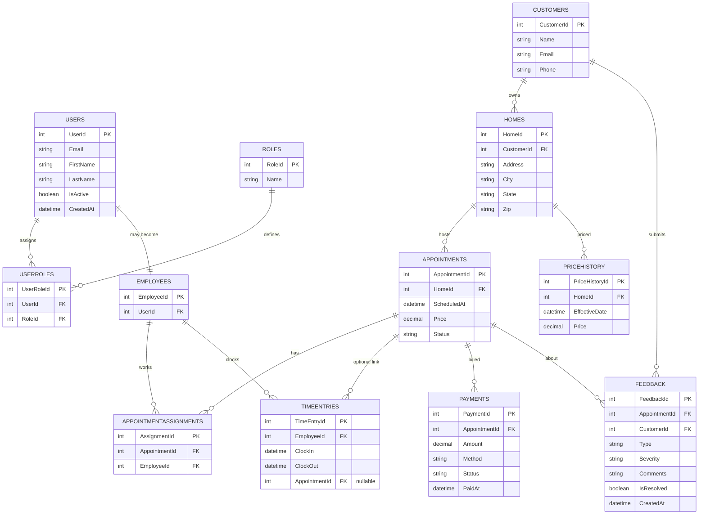

erDiagram

```mermaid
erDiagram
    USERS {
        int UserId PK
        string Email
        string FirstName
        string LastName
        boolean IsActive
        datetime CreatedAt
    }

    ROLES {
        int RoleId PK
        string Name
    }

    USERROLES {
        int UserRoleId PK
        int UserId FK
        int RoleId FK
    }

    EMPLOYEES {
        int EmployeeId PK
        int UserId FK
    }

    CUSTOMERS {
        int CustomerId PK
        string Name
        string Email
        string Phone
    }

    HOMES {
        int HomeId PK
        int CustomerId FK
        string Address
        string City
        string State
        string Zip
    }

    APPOINTMENTS {
        int AppointmentId PK
        int HomeId FK
        datetime ScheduledAt
        decimal Price
        string Status
    }

    APPOINTMENTASSIGNMENTS {
        int AssignmentId PK
        int AppointmentId FK
        int EmployeeId FK
    }

    TIMEENTRIES {
        int TimeEntryId PK
        int EmployeeId FK
        datetime ClockIn
        datetime ClockOut
        int AppointmentId FK "nullable"
    }

    PAYMENTS {
        int PaymentId PK
        int AppointmentId FK
        decimal Amount
        string Method
        string Status
        datetime PaidAt
    }

    FEEDBACK {
        int FeedbackId PK
        int AppointmentId FK
        int CustomerId FK
        string Type
        string Severity
        string Comments
        boolean IsResolved
        datetime CreatedAt
    }

    PRICEHISTORY {
        int PriceHistoryId PK
        int HomeId FK
        datetime EffectiveDate
        decimal Price
    }

    USERS ||--o{ USERROLES : assigns
    ROLES ||--o{ USERROLES : "defines"
    USERS ||--|| EMPLOYEES : "may become"
    CUSTOMERS ||--o{ HOMES : owns
    HOMES ||--o{ APPOINTMENTS : hosts
    APPOINTMENTS ||--o{ APPOINTMENTASSIGNMENTS : has
    EMPLOYEES ||--o{ APPOINTMENTASSIGNMENTS : works
    EMPLOYEES ||--o{ TIMEENTRIES : clocks
    APPOINTMENTS ||--o{ TIMEENTRIES : "optional link"
    APPOINTMENTS ||--o{ PAYMENTS : billed
    CUSTOMERS ||--o{ FEEDBACK : submits
    APPOINTMENTS ||--o{ FEEDBACK : about
    HOMES ||--o{ PRICEHISTORY : priced
```